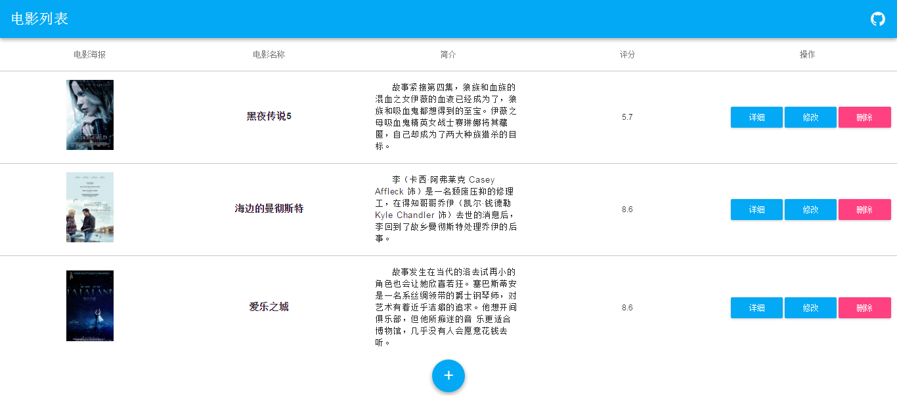
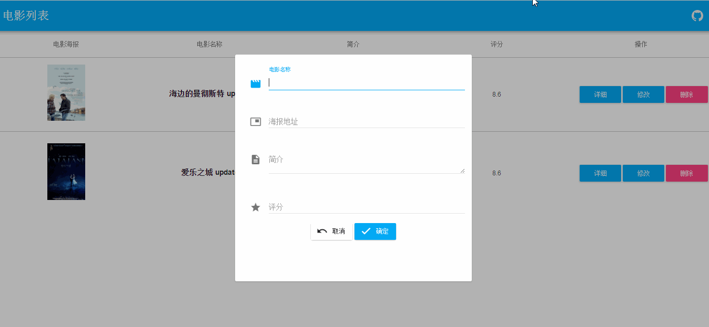
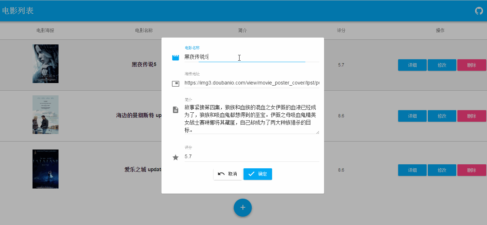
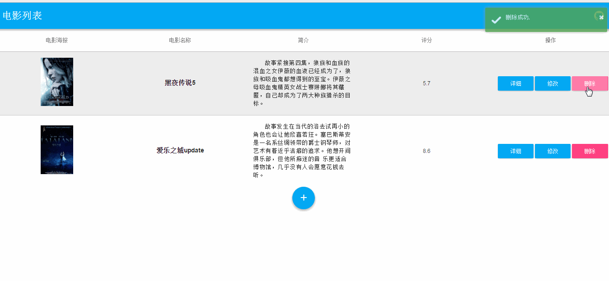
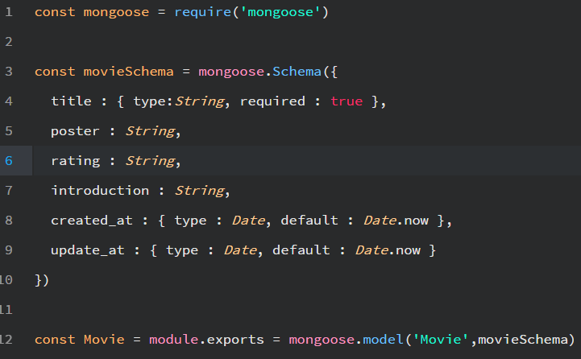

# 一个简单的前后端分离案例

使用到的框架和库

> vuejs vue-router musi-ui axios express mongoose mongodb......

## 简介
一个前后端分离的案例,前端vuejs,后端express,数据库mongodb.
用express的提供api供前端调用,前端ajax请求进行对数据库的CURD操作.

## 效果图
首页

添加电影

更新电影信息

展示电影详情

删除电影


## 开发环境
需要本地安装[node](https://nodejs.org/en/),[npm](https://www.npmjs.com/)或[yarn](https://yarnpkg.com/),[mongodb](https://www.mongodb.com/)

## 初始化
首先用vue-cli初始化项目目录
```bash
vue init webpack my-project

cd my-rpoject && npm install

npm run dev
```  
看到8080端口出现vuejs的欢迎界面表示成功    

接着把本地的mongodb服务跑起来,参考这篇[教程](https://segmentfault.com/a/1190000004868504)

## 后端开发
不过首先把后端的服务搭好,方便以后前端调用,使用npm安装express,mongoose等必须的依赖即可,暂时不考虑验证等东西.
```bash
npm install express body-parser mongoose --save
```
然后在项目根目录添加一个app.js,编写好启动express服务器的代码
```
const express = require('express')
const app = express()
app.use('/',(req,res) => {
  res.send('Yo!')
})
app.listen(3000,() => {
    console.log('app listening on port 3000.')
})
```
浏览器访问localhost:3000,出现res.send()的内容即表示成功.

然后添加需要的数据,新建一个models目录放数据模型,mongoose的每个数据model需要一个schema生成,

新建movie.js文件或者其他的数据模型,用来提供基础数据.



定义了title,poster,rating,introduction,created_at,update_at几个基本信息,最后将model导出即可.

接着将对数据CURD操作的几个路由写出来
## 前端开发

## 结语

## Build Setup

``` bash
# install dependencies
npm install

# serve with hot reload at localhost:8080
npm run dev

# build for production with minification
npm run build

# build for production and view the bundle analyzer report
npm run build --report
```
written by [xrr2016](https://github.com/xrr2016)

## License

[MIT](https://opensource.org/licenses/MIT)
